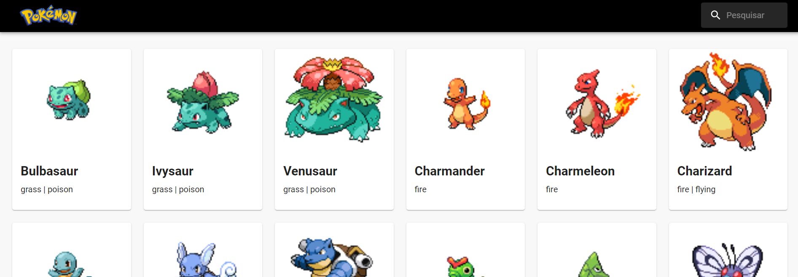

# Lista de tarefas com consumo de API



Este repositório contém uma aplicação de uma Pokédex feita em ReactJS e [Material UI](https://mui.com/material-ui/) para a criação de componentes prontos, rápidos e responsivos.

## Deploy da aplicação
...

## Tecnologias utilizadas
- HTML
- CSS
- JavaScript
- ReactJS

## 📖 Funcionamento

- O app coleta os dados da API [PokéAPI](https://pokeapi.co/)
e renderiza os pokémons em cards com imagem, nome e tipo do pokémon
- Filtragem de pokémons rápida e otimizada no campo de pesquisa com **useMemo()**
- Na próxima etapa será adicionado Rotas, assim ao clicar em algum card o site redimencionará o usuário para uma página com mais informações do pokémon clicado. 

## ⚙️ Como executar localmente

Para executar a aplicação localmente, siga os passos abaixo:

### 1. Clone este repositório:

```bash
  git clone https://github.com/eullergomes/pokedex.git
  cd pokedex

```

### 2. Instale as dependências

 Instalar todas as dependências listadas no arquivo package.json
```bash
  npm install
```


### 3. Inicie a aplicação

```bash
  npm start
```

<h2 id="license">📃 License</h2>

Este projeto está sob licensa do [MIT](LICENSE)
